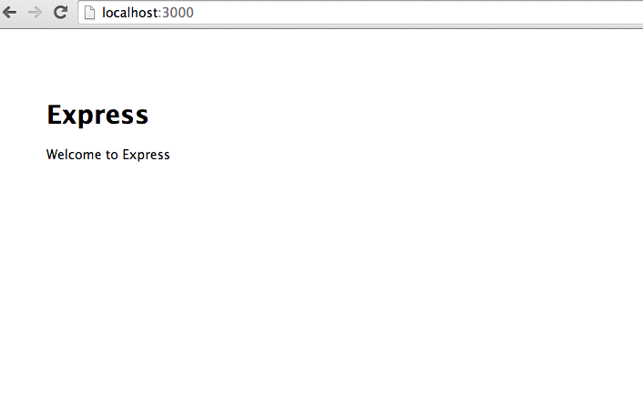
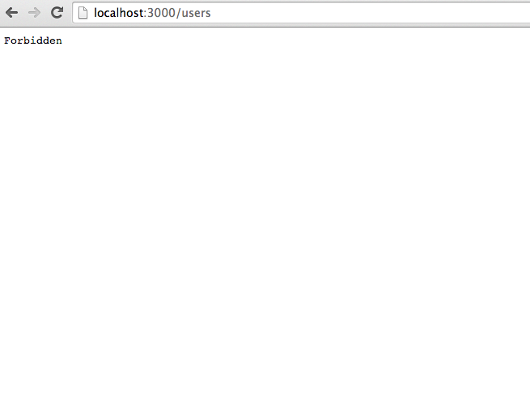

### Key Components

```
middleware/security/identity.js
```

* `identity middleware` - loads the current user’s identity from remote source.

```
middleware/security/authorization.js
```

* `authorization middleware` - authorizes request. hands off whitelist and current user’s
roles to `authorizer`.

```
lib/security/authorizer.js
```

* `authorizer` - contains core authorization logic. compares whiltelist against user’s roles
and determines if there are any in common. so long as there’s at least 1, then the current
user is accepted.

```
lib/security/auth-bundle.js
```

* `authorization bundle` - generates the authorization bundle payload that will be delivered
client side to be consumed by the UI. the output of the auth bundle is embedded into the DOM
to save a roundtrip to the server. once the app bootstraps, it’s fed into angular and bound
to the scope where it can later be consumed by angular templates.

### Post git clone

```sh
$ cd <app-root>
$ npm install
$ bower install
```

### Starting the app

```sh
$ cd bin
$ ./www
```

The app will boot @ `localhost:3000`

### Testing

#### /

should render the home page:



#### /users

should result in a `403` (forbidden)



### TODO

Experiment with dynamically applying middleware to existing routes. This will
prevent us from having to duplicate authorization. We can load a sitemap from a
remote resource and dynamically attach authorization middleware to route at runtime.
